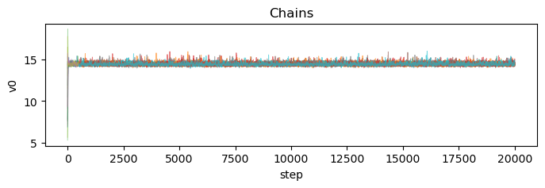
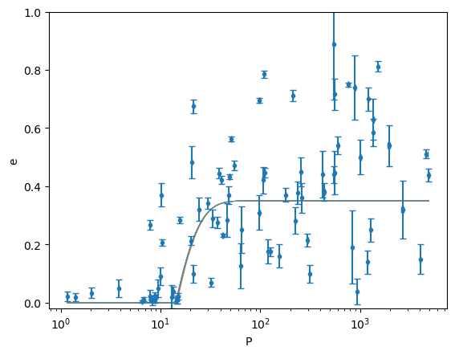
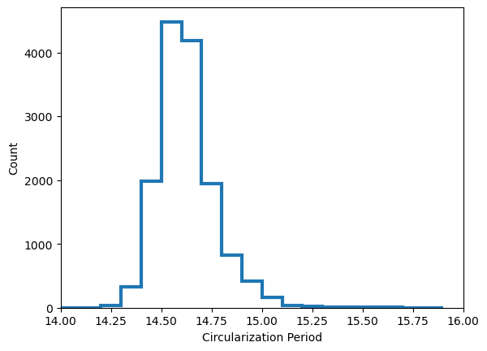

# Determining the Tidal Circularization Period for Open Clusters

*Authors: Ritvik Sai Narayan and Aaron Geller*

This package provides a clean, class-based Python interface for fitting tidal circularization models to stellar binary data using an **MCMC** algorithm with [emcee](https://emcee.readthedocs.io/).  

It implements the functional form from *Meibom & Mathieu (2005)* with Gaussian–Hermite quadrature to account for measurement errors in both period and eccentricity.

*If you use `tidalcircularization` in your work, please cite [Narayan et al. (2026a)](https://doi.org/10.3847/1538-3881/ae2d14).*

---

## Installation

Clone your repo and install dependencies:

```bash
git clone https://github.com/ritviksainarayan/tidalcircularization.git
cd tidalcircularization
pip install -r requirements.txt
```

Dependencies:
- `numpy`
- `pandas`
- `matplotlib`
- `emcee>=3`
- `corner` *(optional, for corner plots)*

---

## Quick Start

```python
import pandas as pd
import numpy as np
import matplotlib.pyplot as plt
import tidalcircularization as tc

# Load your dataframe with columns:
#   Per     = orbital period
#   e       = eccentricity
#   e_Per   = error in period
#   e_e     = error in eccentricity
df = pd.read_csv("orbits.csv") # example orbit list from NGC 188
print(df)
```
```
PKM         Per      e     e_Per    e_e
0    269  553.202006  0.716  2.718705  0.054
1    583  119.780691  0.177  0.039886  0.041
2   3719   51.574489  0.562  0.001612  0.008
3   3755   10.326005  0.206  0.000094  0.011
4   3953  940.380237  0.038  2.493827  0.045
..   ...         ...    ...       ...    ...
76  5080  550.400000  0.440  1.900000  0.030
77  5147    6.743200  0.012  0.000400  0.006
78  5710  298.800000  0.215  1.300000  0.023
79  5762    6.504300  0.004  0.000040  0.004
80  8894   14.484700  0.008  0.001500  0.010

[81 rows x 5 columns]
```

```python
# Run MCMC fit (with defaults)
results = tc.fit(df,ncores=8)
```
```
100%|██████████| 20000/20000 [01:19<00:00, 252.56it/s]
Autocorrelation time: [27.70989528]
Thinning interval: 27
```
```python
# Print parameter summary
results.print_results()
```
```
emcee results with 1-sigma uncertainties
Pcut = 14.4022 +0.1383 -0.1066
```
```python
# Chain trace plots
results.plot_chains()
```

```python
# Posterior model draws over data
results.plot_model_draws(
    df['Per'], df['e'], df['e_Per'], df['e_e'], tc.CircularizationModel()
)
```

```python
# Compute Pcirc distribution (eccentricity = 0.01)
pcirc = results.pcirc_distribution(tc.CircularizationModel())

fig,ax = plt.subplots()
ax.hist(x=pcirc,histtype='step',linewidth=3,bins=np.arange(12,16,0.1))
ax.set_xlim(left=14,right=16)
ax.set_xlabel('Circularization Period')
ax.set_ylabel('Count')
plt.show()
```


---

## API Overview

### Core Classes
- **`CircularizationModel`**
  - Implements the eccentricity vs. period model.
- **`GaussHermiteLikelihood`**
  - Likelihood calculation with quadrature integration.
- **`UniformPrior`**
  - Uniform prior for parameters.
- **`Posterior`**
  - Combines prior and likelihood.
- **`MCMCConfig`**
  - Configuration for sampler (walkers, steps, etc.).
- **`MCMCResults`**
  - Stores chains, samples, plots, summaries, and derived quantities.

### High-level Functions
- **`fit(df, ...)`**
  - One-liner: run full MCMC given a DataFrame.

- **`run_mcmc(x, y, sigma_x, sigma_y, ...)`**
  - Lower-level: run MCMC with explicit arrays.

---

## Configurable Parameters

```python
results = tc.fit(
    df,
    guess0=(10.0),        # initial guess for Pcut
    nfac=(3.0),           # scatter around initial guess
    nwalkers=20,
    nsamples=20_000,
    nburn=500,
    ncores=6,              # multiprocessing cores
    prior_bounds=(0, 20),  # uniform prior bounds for Pcut
    random_seed=42
)
```

---

## Outputs

- **`results.summary`** → dict `{param: (median, +σ, -σ)}`
- **`results.samples`** → posterior draws after burn-in & thinning
- **`results.plot_chains()`** → trace plot
- **`results.plot_corner()`** → posterior correlations (requires `corner`)
- **`results.plot_model_draws(...)`** → posterior model overlays
- **`results.pcirc_distribution(...)`** → array of Pcirc values


## Reference

- **Meibom, S., & Mathieu, R. D. (2005).** "A Study of Tidal Circularization in the Solar-Type Spectroscopic Binary Population of the Open Cluster M35." *ApJ*, 620, 970.

---
